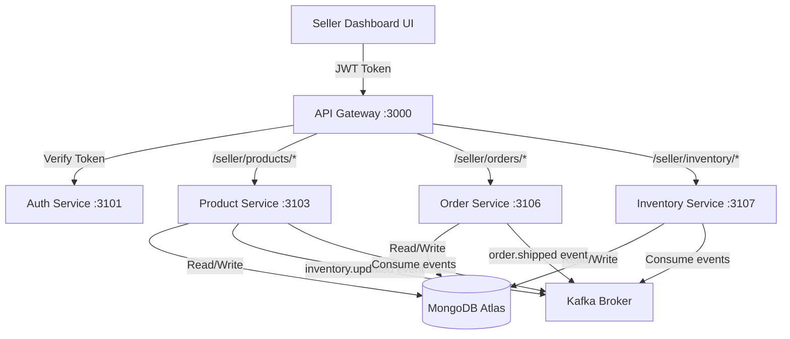
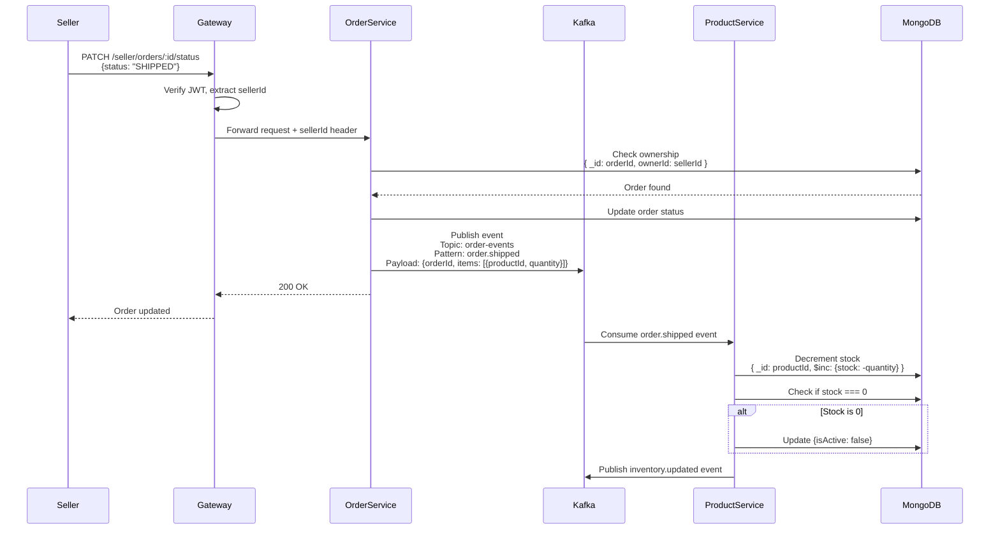
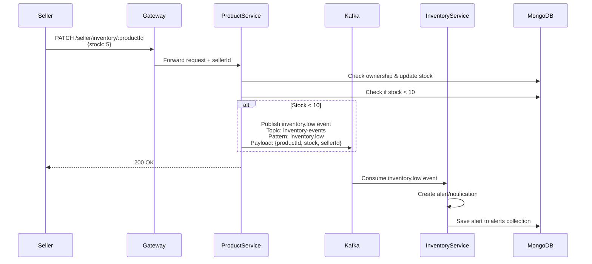

# Tài liệu Thiết kế - Seller Dashboard Backend

## Tổng quan

Seller Dashboard Backend được thiết kế để tích hợp vào kiến trúc microservices hiện tại của Click2Buy. Thay vì tạo một seller-service riêng biệt, chúng ta sẽ mở rộng các service hiện có (product-service, order-service) với các API và logic dành riêng cho seller, đồng thời sử dụng Kafka để đồng bộ dữ liệu giữa các services.

## Phân tích Kiến trúc: Seller Service riêng vs Mở rộng Services hiện có

### Phương án 1: Tạo Seller Service riêng

**Ưu điểm:**
- Tách biệt rõ ràng business logic của seller
- Dễ scale độc lập khi lượng seller tăng
- Không ảnh hưởng đến code hiện tại của product-service và order-service
- Tuân thủ nguyên tắc Single Responsibility

**Nhược điểm:**
- Tăng độ phức tạp của hệ thống (thêm 1 service, 1 database connection)
- Cần duplicate logic validation và business rules
- Tăng network latency (seller-service phải gọi sang product-service, order-service)
- Khó đảm bảo data consistency (cần distributed transaction hoặc saga pattern)
- Tăng chi phí infrastructure (thêm container, resources)

### Phương án 2: Mở rộng Product Service và Order Service (KHUYẾN NGHỊ)

**Ưu điểm:**
- Tận dụng database và business logic hiện có
- Giảm network hops, cải thiện performance
- Dễ đảm bảo data consistency (cùng database transaction)
- Đơn giản hóa deployment và monitoring
- Phù hợp với quy mô hiện tại (chưa cần scale riêng cho seller)
- Code gọn gàng hơn với việc filter theo ownerId/sellerId

**Nhược điểm:**
- Service có nhiều responsibility hơn (vừa phục vụ buyer vừa seller)
- Cần cẩn thận trong việc phân quyền và filter data

### Quyết định Kiến trúc

**Chọn Phương án 2** vì:
1. Hệ thống hiện tại đã có sẵn `ownerId` trong Product schema và Order schema
2. Logic nghiệp vụ của seller chủ yếu là CRUD và query với filter theo ownerId
3. Không có yêu cầu scale riêng cho seller traffic
4. Giảm complexity và dễ maintain hơn

**Chiến lược triển khai:**
- Thêm seller-specific endpoints vào Product Service và Order Service
- Sử dụng middleware/guard để phân quyền seller
- Filter tất cả queries theo sellerId (từ JWT token)
- Sử dụng Kafka events để đồng bộ giữa services khi cần

## Kiến trúc Tổng thể



## Thiết kế API

### 1. Product Service APIs (Port 3103)

#### 1.1 Quản lý Sản phẩm

**POST /seller/products**
- Mô tả: Tạo sản phẩm mới
- Auth: Required (JWT với role seller)
- Request Body:
```json
{
  "name": "iPhone 15 Pro",
  "description": "Latest iPhone",
  "price": 999,
  "salePrice": 899,
  "stock": 100,
  "brand": "Apple",
  "condition": "new",
  "tags": ["smartphone", "apple"],
  "images": ["url1", "url2"],
  "categoryIds": ["cat1"],
  "warehouseAddress": {
    "line1": "123 Main St",
    "city": "Hanoi"
  }
}
```
- Response: Product object với ownerId = sellerId từ token
- Service: Product Service
- Logic: Tự động set ownerId từ JWT token

**GET /seller/products**
- Mô tả: Lấy danh sách sản phẩm của seller
- Auth: Required
- Query Params: `?page=1&limit=20&search=keyword&isActive=true`
- Response: Paginated list of products
- Service: Product Service
- Logic: Filter `{ ownerId: sellerId }`

**GET /seller/products/:id**
- Mô tả: Xem chi tiết sản phẩm
- Auth: Required
- Response: Product object
- Service: Product Service
- Logic: Kiểm tra `ownerId === sellerId`

**PATCH /seller/products/:id**
- Mô tả: Cập nhật sản phẩm
- Auth: Required
- Request Body: Partial product fields
- Service: Product Service
- Logic: Kiểm tra ownership trước khi update

**DELETE /seller/products/:id**
- Mô tả: Xóa sản phẩm
- Auth: Required
- Service: Product Service
- Logic: Kiểm tra `ownerId === sellerId` và `stock === 0`

#### 1.2 Quản lý Tồn kho

**GET /seller/inventory**
- Mô tả: Xem tồn kho tất cả sản phẩm
- Auth: Required
- Query Params: `?lowStock=true` (filter stock < 10)
- Response: Array of `{ productId, name, stock, isActive }`
- Service: Product Service
- Logic: Aggregate từ products collection với filter ownerId

**PATCH /seller/inventory/:productId**
- Mô tả: Cập nhật số lượng tồn kho
- Auth: Required
- Request Body: `{ stock: 150, operation: "set" | "increment" | "decrement" }`
- Service: Product Service
- Kafka Event: Publish `inventory.updated` event
- Logic: 
  - Kiểm tra ownership
  - Update stock
  - Nếu stock === 0, set isActive = false
  - Nếu stock < 10, publish `inventory.low` event

### 2. Order Service APIs (Port 3106)

#### 2.1 Quản lý Đơn hàng

**GET /seller/orders**
- Mô tả: Lấy danh sách đơn hàng chứa sản phẩm của seller
- Auth: Required
- Query Params: `?status=PENDING&page=1&limit=20&startDate=2024-01-01&endDate=2024-12-31`
- Response: Paginated list of orders
- Service: Order Service
- Logic: Filter `{ ownerId: sellerId }` hoặc `{ "items.ownerId": sellerId }` nếu order có nhiều seller

**GET /seller/orders/:id**
- Mô tả: Xem chi tiết đơn hàng
- Auth: Required
- Response: Order object với items filtered theo sellerId
- Service: Order Service
- Logic: Kiểm tra seller có sản phẩm trong order không

**PATCH /seller/orders/:id/status**
- Mô tả: Cập nhật trạng thái đơn hàng
- Auth: Required
- Request Body: `{ status: "PROCESSING" | "SHIPPED" | "DELIVERED" }`
- Service: Order Service
- Kafka Events:
  - `order.status.updated` khi status thay đổi
  - `order.shipped` khi status = SHIPPED (để trừ inventory)
- Logic:
  - Kiểm tra ownership
  - Validate state transition
  - Update status
  - Publish Kafka event

#### 2.2 Thống kê và Báo cáo

**GET /seller/analytics/revenue**
- Mô tả: Thống kê doanh thu
- Auth: Required
- Query Params: `?startDate=2024-01-01&endDate=2024-12-31&groupBy=day|week|month`
- Response:
```json
{
  "totalRevenue": 50000,
  "totalOrders": 120,
  "averageOrderValue": 416.67,
  "breakdown": [
    { "period": "2024-01", "revenue": 10000, "orders": 25 }
  ]
}
```
- Service: Order Service
- Logic: Aggregate từ orders collection với filter ownerId

**GET /seller/analytics/top-products**
- Mô tả: Sản phẩm bán chạy nhất
- Auth: Required
- Query Params: `?limit=10&startDate=2024-01-01`
- Response: Array of `{ productId, name, totalSold, revenue }`
- Service: Order Service
- Logic: Aggregate từ order items với filter ownerId

**GET /seller/dashboard/overview**
- Mô tả: Tổng quan dashboard
- Auth: Required
- Response:
```json
{
  "totalProducts": 50,
  "activeProducts": 45,
  "lowStockProducts": 5,
  "totalOrders": 120,
  "pendingOrders": 10,
  "totalRevenue": 50000,
  "revenueThisMonth": 8000
}
```
- Service: Order Service (orchestrate calls to Product Service nếu cần)
- Logic: Aggregate metrics từ nhiều nguồn

### 3. Inventory Service APIs (Port 3107 - Service mới)

**Lưu ý:** Inventory Service là service mới cần tạo để xử lý logic phức tạp về tồn kho

**GET /seller/inventory/alerts**
- Mô tả: Lấy danh sách cảnh báo tồn kho thấp
- Auth: Required
- Response: Array of low stock products
- Service: Inventory Service
- Logic: Query products với stock < threshold

**POST /seller/inventory/bulk-update**
- Mô tả: Cập nhật hàng loạt tồn kho (import từ file)
- Auth: Required
- Request Body: Array of `{ productId, stock }`
- Service: Inventory Service
- Logic: Batch update với transaction

## Luồng Dữ liệu và Kafka Events

### Event Flow 1: Seller cập nhật trạng thái đơn hàng → Trừ tồn kho



### Event Flow 2: Seller cập nhật tồn kho → Cảnh báo low stock



### Kafka Topics và Events

#### Topic: `order-events`

**Event: order.status.updated**
```json
{
  "eventId": "uuid",
  "timestamp": "2024-01-15T10:30:00Z",
  "pattern": "order.status.updated",
  "data": {
    "orderId": "order123",
    "sellerId": "seller456",
    "oldStatus": "PENDING",
    "newStatus": "PROCESSING"
  }
}
```

**Event: order.shipped**
```json
{
  "eventId": "uuid",
  "timestamp": "2024-01-15T10:30:00Z",
  "pattern": "order.shipped",
  "data": {
    "orderId": "order123",
    "sellerId": "seller456",
    "items": [
      {
        "productId": "prod789",
        "quantity": 2,
        "price": 999
      }
    ]
  }
}
```

#### Topic: `inventory-events`

**Event: inventory.updated**
```json
{
  "eventId": "uuid",
  "timestamp": "2024-01-15T10:30:00Z",
  "pattern": "inventory.updated",
  "data": {
    "productId": "prod789",
    "sellerId": "seller456",
    "oldStock": 100,
    "newStock": 98,
    "operation": "decrement"
  }
}
```

**Event: inventory.low**
```json
{
  "eventId": "uuid",
  "timestamp": "2024-01-15T10:30:00Z",
  "pattern": "inventory.low",
  "data": {
    "productId": "prod789",
    "sellerId": "seller456",
    "currentStock": 5,
    "threshold": 10
  }
}
```

## Mô hình Dữ liệu (Database Updates)

### 1. Products Collection (Đã có sẵn ownerId)

Schema hiện tại đã có trường `ownerId`, không cần thay đổi:

```typescript
{
  _id: ObjectId,
  name: string,
  ownerId: string,  // ✅ Đã có - dùng làm sellerId
  description: string,
  price: number,
  salePrice: number,
  stock: number,
  isActive: boolean,
  brand: string,
  condition: "new" | "used",
  tags: string[],
  images: string[],
  categoryIds: string[],
  warehouseAddress: {
    line1: string,
    city: string,
    // ...
  },
  createdAt: Date,
  updatedAt: Date
}
```

**Indexes cần thêm:**
```javascript
db.products.createIndex({ ownerId: 1, isActive: 1 })
db.products.createIndex({ ownerId: 1, stock: 1 })
db.products.createIndex({ ownerId: 1, createdAt: -1 })
```

### 2. Orders Collection (Đã có ownerId)

Schema hiện tại đã có `ownerId`, nhưng cần mở rộng để hỗ trợ multi-seller orders:

**Cập nhật schema:**
```typescript
{
  _id: ObjectId,
  userId: string,
  ownerId: string,  // ✅ Đã có - sellerId chính (nếu single seller)
  items: [
    {
      productId: string,
      quantity: number,
      price: number,
      sellerId: string  // ⚠️ CẦN THÊM - để hỗ trợ multi-seller
    }
  ],
  total: number,
  status: string,  // PENDING_PAYMENT, PROCESSING, SHIPPED, DELIVERED, CANCELLED
  expiresAt: Date,
  createdAt: Date,
  updatedAt: Date
}
```

**Indexes cần thêm:**
```javascript
db.orders.createIndex({ ownerId: 1, status: 1 })
db.orders.createIndex({ "items.sellerId": 1, createdAt: -1 })
db.orders.createIndex({ ownerId: 1, createdAt: -1 })
```

### 3. Inventory Alerts Collection (MỚI)

Collection mới để lưu cảnh báo tồn kho:

```typescript
{
  _id: ObjectId,
  productId: string,
  sellerId: string,
  productName: string,
  currentStock: number,
  threshold: number,
  status: "active" | "resolved",
  createdAt: Date,
  resolvedAt: Date
}
```

**Indexes:**
```javascript
db.inventory_alerts.createIndex({ sellerId: 1, status: 1 })
db.inventory_alerts.createIndex({ productId: 1, status: 1 })
```

### 4. Users Collection (Cần thêm role seller)

Cập nhật để phân biệt seller và buyer:

```typescript
{
  _id: ObjectId,
  email: string,
  password: string,
  name: string,
  role: "buyer" | "seller" | "admin",  // ⚠️ CẦN THÊM
  sellerInfo: {  // ⚠️ CẦN THÊM - chỉ có khi role = seller
    businessName: string,
    taxId: string,
    phone: string,
    address: object
  },
  createdAt: Date,
  updatedAt: Date
}
```

## Components và Interfaces

### 1. Middleware/Guards

**SellerAuthGuard** (API Gateway)
```typescript
// Kiểm tra JWT token có role = "seller"
// Extract sellerId từ token payload
// Inject sellerId vào request header: x-seller-id
```

**OwnershipGuard** (Product Service, Order Service)
```typescript
// Đọc sellerId từ header x-seller-id
// Kiểm tra ownerId của resource === sellerId
// Throw 403 nếu không match
```

### 2. Kafka Producers/Consumers

**OrderEventProducer** (Order Service)
```typescript
class OrderEventProducer {
  async publishOrderShipped(orderId, items) {
    await kafka.send({
      topic: 'order-events',
      messages: [{
        key: orderId,
        value: JSON.stringify({
          pattern: 'order.shipped',
          data: { orderId, items }
        })
      }]
    })
  }
}
```

**InventoryEventConsumer** (Product Service)
```typescript
class InventoryEventConsumer {
  @EventPattern('order.shipped')
  async handleOrderShipped(data) {
    for (const item of data.items) {
      await this.productService.decrementStock(
        item.productId,
        item.quantity
      )
    }
  }
}
```

## Xử lý Lỗi

### 1. API Errors

- **401 Unauthorized**: Token không hợp lệ hoặc thiếu
- **403 Forbidden**: User không phải seller hoặc không có quyền truy cập resource
- **404 Not Found**: Resource không tồn tại
- **400 Bad Request**: Dữ liệu đầu vào không hợp lệ
- **409 Conflict**: Xung đột nghiệp vụ (VD: xóa sản phẩm còn stock > 0)
- **500 Internal Server Error**: Lỗi server

### 2. Kafka Event Failures

- Retry với exponential backoff (3 lần)
- Log error vào MongoDB collection `event_failures`
- Alert admin nếu retry thất bại
- Dead Letter Queue cho events không xử lý được

### 3. Data Consistency

- Sử dụng MongoDB transactions cho operations quan trọng
- Implement idempotency cho Kafka consumers (check eventId đã xử lý chưa)
- Eventual consistency cho non-critical operations

## Chiến lược Testing

### 1. Unit Tests
- Test business logic của từng service
- Mock Kafka producers/consumers
- Test ownership validation logic

### 2. Integration Tests
- Test API endpoints với authentication
- Test Kafka event flow end-to-end
- Test database queries và indexes

### 3. E2E Tests
- Test user journey: Tạo sản phẩm → Nhận đơn hàng → Cập nhật trạng thái → Kiểm tra inventory
- Test multi-seller order scenarios

## Cân nhắc về Performance

1. **Database Indexing**: Đã định nghĩa indexes cho các query patterns phổ biến
2. **Caching**: Có thể cache seller dashboard overview với Redis (TTL 5 phút)
3. **Pagination**: Tất cả list APIs đều có pagination
4. **Kafka Partitioning**: Partition theo sellerId để đảm bảo ordering
5. **Connection Pooling**: Sử dụng connection pool cho MongoDB và Kafka

## Migration Plan

### Phase 1: Database Updates
1. Thêm indexes vào products và orders collections
2. Thêm trường `sellerId` vào order items
3. Tạo inventory_alerts collection
4. Update users collection với role và sellerInfo

### Phase 2: Service Updates
1. Thêm seller endpoints vào Product Service
2. Thêm seller endpoints vào Order Service
3. Implement Kafka producers/consumers
4. Update API Gateway với seller routes

### Phase 3: Testing & Deployment
1. Unit tests và integration tests
2. Deploy lên staging environment
3. E2E testing
4. Production deployment với feature flag
